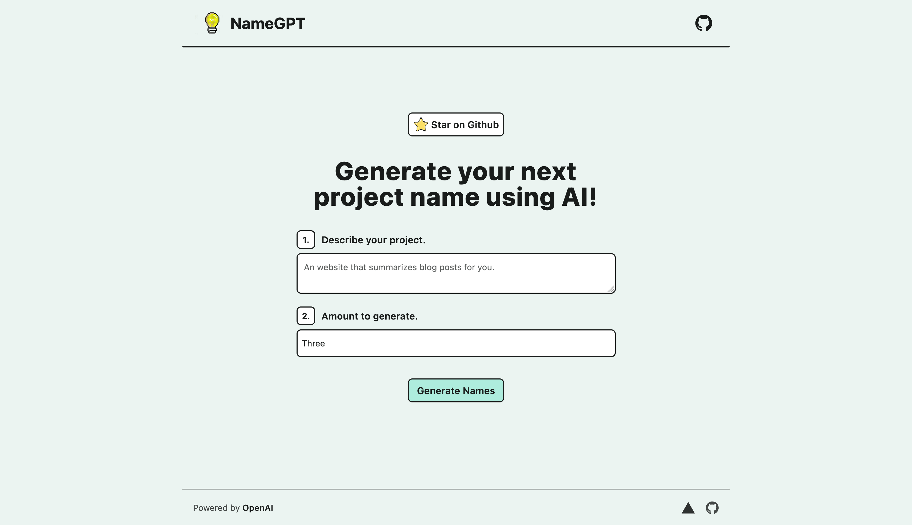

# [NameGPT](namegpt.chroxify.com)

**Description**:  This project lets you generate unique project names based on a simpel description.

[](https://namegpt.vercel.com)

## How it works?

 NameGPT uses the GPT-3 API to generate unique names on the based user input. It sends the prompt to the GPT-3 API which returns an array of names based on that requested prompt.

## Running Locally 
 #### Clone the Repository 
  ```bash
  git clone https://github.com/chroxify/namegpt.git
  ```

 #### Create an OpenAI API Key
 1. Go to [OpenAI](https://platform.openai.com/login) to create an account.
 2. Visit the [API Keys Page](https://platform.openai.com/account/api-keys) 
 3. Click `Create new secret key` and copy the key

#### Store the API Key in .env
Create a `.env` file at the root of the cloned directory and fill it out as shown in the `.env.example` file.

#### Run the application
```bash
npm run dev
```
This will run the application in dev mode on `https://localhost:3000`.

## One-Click Deployment
Deploy easily with one click using [Vercel](https://vercel.com)

[](https://vercel.com/new/project?template=https://github.com/chroxify/namegpt)